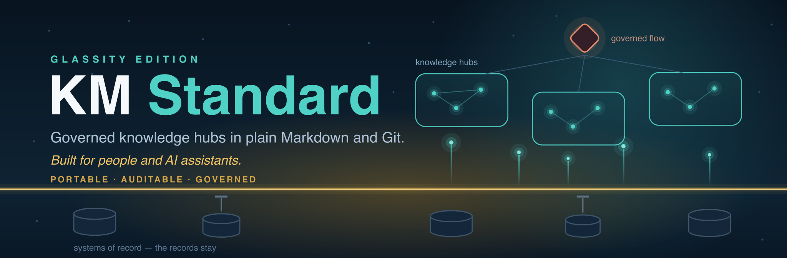

<em>The open standard for governed knowledge hubs — built for organizations and their agents.</em>

  
  
  
  
  

  &nbsp;
  &nbsp;
  &nbsp;
  &nbsp;
  

# Knowledge Management Standard

**Current version: v1.52** (2026-08-24, a status is read where a status is declared, and quoted
everywhere else; two checks read publication status out of the version-history table and both
searched the draft-declaration token *anywhere* in a row, while the rule the first one's own
docstring stated is narrower and correct — a row is unpublished when its description **opens with**
a declaration; the difference was measured during the v1.50 publish rather than theorised, because
that row evidenced a claim by reproducing the v1.23 row's own `**DRAFT — awaiting owner push**`
verbatim mid-description, so once its opener had been flipped to its published stamp
`validate_ledger_dates.py` reported `2 excluded as drafted, v1.23, v1.50` and never opened v1.50's
date column while `validate_published_not_draft.py` reported `49 published, 2 unpublished` and
exempted every draft marking naming v1.50 from judgement, three of them real and stale — **both
returned PASS over an incomplete publication**, and the cause was house practice rather than an
unusual input, since quoting the text a rule governs is what a remediation record does constantly;
**the rule is now anchored to the opening of the description cell**, tolerating whitespace and
emphasis and nothing else, and **it has one home**, `scripts/publication_status.py`, which both
instruments import and neither duplicates; the negative direction is the whole proof, because the
tree passed before the repair and would pass under a pattern that had stopped matching, so the
canaries run the same fixtures through the superseded pattern and run the real material at
`1444b15` in both states; v1.51 is the preceding published version and v1.23 remains an
unpublished draft awaiting its own push). The full
ledger of released versions, and the rule that a published version number is never reused, is in
[`STANDARD.md`](STANDARD.md) → *Version history*.
Pin the version you adopted; adopting a later one is a decision, not a background update.

A reproducible, organization-agnostic framework for standing up a governed, agent-readable knowledge
hub for any initiative — a project, a team, a product line, a nonprofit, a research group. It is not
tied to any specific company, industry, or AI vendor.

## What's in this package

| Path | What it is |
|---|---|
| [`STANDARD.md`](STANDARD.md) | The full standard — architecture, governance rules, frontmatter spec, ontology layer, checklists. Read this first. |
| [`template/`](template/) | A ready-to-copy reference hub: stub docs, `context.jsonld`, `km-deployment.md`, entity-note folders (`decisions/`, `risks/`, `stakeholders/`, `milestones/`, `partners/`, `corrections/`, plus the optional `relationships/`, `claims/`, and `sources/systems/`), governance files, and the per-hub agent skills (`km-intake`, `km-propose`, `km-gather`, `km-start`, `km-handover`, `km-brief`) already wired up for Claude Code and AGENTS.md-compatible tools. |
| [`rfcs/`](rfcs/README.md) | Design RFCs, seven of them, each a dated design record that is never rewritten to agree with what happened afterwards. **Start at [`rfcs/README.md`](rfcs/README.md), the index**, which records for every proposal its status, the published version that implemented it, where a design was implemented in narrowed form, and how the RFC badge above is generated from that table rather than counted by hand. |
| [`contracts/organization-profile.schema.json`](contracts/organization-profile.schema.json) | Portable JSON contract for an approved Enterprise Knowledge Layer organization profile. |
| [`scripts/validate_organization_profile.py`](scripts/validate_organization_profile.py) | Dependency-free validator for profile shape, compatibility, safe paths, and module eligibility. |
| [`skills/km-init/`](skills/km-init/SKILL.md) | Workspace-level skill: runs the purpose interview and either stands up a brand-new hub from `template/` or adopts a directory that already exists, writing only what it lacks. |
| [`skills/km-supervise/`](skills/km-supervise/SKILL.md) | Optional workspace-level skill: routes a source that touches multiple hubs (the "Supervisor tier"). Includes a starter `_KM_Supervisor_template/`. |
| [`skills/km-brief/`](skills/km-brief/SKILL.md) | Per-hub skill: generates an audience-tailored memo/briefing/status report by querying entity notes instead of freehand-reading hub docs. |
| [`components/km-cockpit/`](components/km-cockpit/README.md) | Optional side component (published as v1.24, 2026-08-17): the KM Cockpit — the owner decision surface. Renders the owner queue as full-context decision cards on localhost; configured entirely by a deployment manifest; never published beside a reading site. Normative contract in [`SPEC.md`](components/km-cockpit/SPEC.md). |
| [`agents/km-hub-builder/`](agents/km-hub-builder/SKILL.md) | Optional Standard Maintainer package: one governed contract, distributable Claude and Codex adapters, safe installation, and runtime-parity checks. It changes standards and hands adoption to the Supervisor; it never edits hubs. |
| [`docs/architecture/`](docs/architecture/README.md) | **A historical v1.22 snapshot, not the current architecture.** The layer model, the canonical-first hub deployment protocol, the OrganizationProfile contract, and authority boundaries, as they stood at v1.22. Descriptive, not normative, and not maintained forward: the cockpit, the projection contract, the supervisor threshold, hub merge, editions, the Reader tier, the MCP quarantine and the release gate all postdate it and are described in [`STANDARD.md`](STANDARD.md) instead. |

## Quick start — one hub

1. Read [`STANDARD.md`](STANDARD.md), sections "Purpose" through "Governance Layer."
2. Copy [`template/`](template/) to your new hub's location, e.g. `cp -R template/ ~/projects/my-initiative`.
3. Replace every `{{PLACEHOLDER}}` in the copied files (see the placeholder map in
   [`skills/km-init/SKILL.md`](skills/km-init/SKILL.md)) — or, if you're using an AI agent that
   supports custom skills, install `skills/km-init/SKILL.md` and invoke it to do this
   interactively.
4. `git init`, make the initial commit, and run `hub-scan.sh` (Steps 1 and 4–5 in `STANDARD.md`).
   That scaffold commit is the one place a blanket `git add -A` is safe; after it, stage the paths you
   touched (see *Rule 3 → Stage explicitly*), which matters most when the hub lives in synced storage.
5. Start working: drop files in `_inbox/`, propose changes in `changes/`, run `hub-scan.sh` at the
   start of every session. Track individual decisions/risks/stakeholders/milestones/partners as entity
   notes (`decisions/`, `risks/`, `stakeholders/`, `milestones/`, `partners/`), not as table rows in
   the numbered docs — see "Ontology & Entity Layer" in `STANDARD.md`. Use `/km-brief` to generate a
   memo or briefing from those entity notes for a given audience.

`km-init` always creates a canonical-only hub and records its canonical version, revision, and source
in `km-deployment.md`. Organization binding is a separate Supervisor action. The Supervisor resolves
and validates an approved OrganizationProfile from the configured Enterprise Knowledge Layer, then
records the organization customization in a second commit.

No AI agent is required to use this standard — it works as a plain governance discipline for a
human-maintained markdown folder. The optional skills exist to automate the mechanical parts (digesting
sources, drafting proposals, running the scan) for teams using an AI coding/knowledge assistant.

## Quick start — more than one hub

The moment a workspace runs more than one hub, the standard advises creating the Supervisor
tier (v1.26) — starting from the **minimum tier**: a hub registry, an estate queue,
an inbox, and its own git history, with every further capability adopted against a named
condition. See "The supervisor threshold" and "Supervisor Tier — Cross-Hub Orchestration" in
`STANDARD.md`, and [`skills/km-supervise/`](skills/km-supervise/SKILL.md) for the routing
skill (adopted when a source first spans two hubs).

## License / reuse

**No licence has been declared for this repository, so default copyright applies and no reuse grant
is in force.** Free adoption is the owner's stated intent: this standard is meant to be adopted,
adapted, forked, and redistributed for any organization's internal or external knowledge management
needs, with no attribution required. Intent is not a licence, so until one is declared a reader may
rely on that intent as a statement of direction and never as permission. Choosing a licence, or
choosing not to, is an open decision and it belongs to the repository owner. Nothing on this page is
legal advice. The open decision is recorded in [`STANDARD.md`](STANDARD.md) → *The boundary asserts
no license*.
