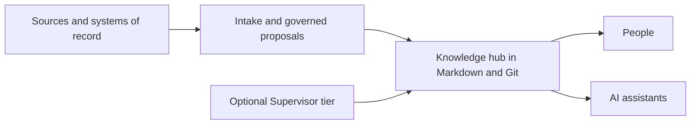

# KM Standard - Glassity Edition

**A governed knowledge-hub framework for people and AI assistants, built in plain Markdown and Git.**

KM Standard helps teams turn scattered project material into decision-grade, auditable knowledge
without depending on a proprietary knowledge platform.

> **Baseline:** Glassity Edition - based on KM Standard v1.64 
> Normative baseline: [`STANDARD.md`](STANDARD.md) · Edition history: [`CHANGELOG.md`](CHANGELOG.md)

  
  
  
  

**Start here:** [Adopt the Standard](docs/adopting.md) · [Maintain this edition](docs/maintaining.md)
· [Read the Standard](STANDARD.md) · [Browse the docs](docs/README.md)

## Choose your path

### Adopt a knowledge hub

Use the reference template to create a portable, Git-governed hub for one initiative. Keep source
records in their authoritative systems while the hub retains reviewed evidence, claims, decisions,
and working knowledge. The framework works with people alone or with optional AI skills that
automate intake, proposals, scans, handovers, briefs, and publication.

**Next:** follow [`docs/adopting.md`](docs/adopting.md) or start from [`template/`](template/).

### Evolve the Standard

Maintain the package through explicit authority, dated design records, red-before-repair evidence,
exact staging, and one direct release gate. Descriptive guides never override `STANDARD.md`, and a
cache never substitutes for an authoritative gate result. Glassity-specific normative changes must
cross the edition boundary visibly.

**Next:** read [`docs/maintaining.md`](docs/maintaining.md) and the
[`Standard Maintainer`](STANDARD.md#standard-maintainer) contract.

## Why this exists

Project knowledge often ends up split across documents, messages, issue trackers, repositories, and
AI conversations. The KM Standard supplies a stable boundary around the knowledge worth retaining:
where it came from, what is claimed, what was decided, what remains uncertain, and who may change
it. Plain files keep that record inspectable and portable; governance keeps it trustworthy.

It is organization-agnostic and vendor-neutral. It can support a project, team, product, nonprofit,
research group, or any initiative that needs evidence-backed continuity.

## What you get

- A normative governance and architecture standard.
- A ready-to-copy hub with schemas, scans, handover, and proposal workflow.
- Optional skills for AI-assisted intake, maintenance, briefing, and publication.
- Entity notes for decisions, risks, stakeholders, milestones, partners, corrections, claims,
  relationships, and source systems.
- An optional Supervisor tier for routing and governing work across multiple hubs.
- A release gate that discovers and checks the maintained package before publication.

## How it works

Source records remain in their systems of record. The hub governs the retained evidence, claims,
decisions, and working knowledge that people and assistants use.

## Quick start for adopters

1. Read [`STANDARD.md`](STANDARD.md) from **Purpose** through **Governance Layer**.
2. Copy [`template/`](template/) into the initiative workspace, or use
   [`km-init`](skills/km-init/SKILL.md).
3. Replace the placeholders and record the inherited version and source in `km-deployment.md`.
4. Initialize Git, commit the scaffold, and run `hub-scan.sh`.
5. Add inputs through `_inbox/`, review proposals in `changes/`, and stage later edits by exact path.

For multiple hubs, add the minimum Supervisor tier when a source first crosses hub boundaries. See
[`km-supervise`](skills/km-supervise/SKILL.md) and the
[`supervisor threshold`](STANDARD.md#the-supervisor-threshold).

## Quick start for maintainers

1. Read [`docs/maintaining.md`](docs/maintaining.md) and locate the authority for the change.
2. Record the proposal and, for a defect, reproduce it on the unrepaired tree first.
3. Make the smallest accepted change and stage exact paths.
4. Run `python3 tools/km-release-gate.py` directly.
5. Record the exit status and evidence before proposing publication.

## Repository map

| Path | Purpose |
|---|---|
| [`STANDARD.md`](STANDARD.md) | Current normative architecture, governance, schemas, and release history. |
| [`template/`](template/) | Reference hub. Its entity-note folders (`decisions/`, `risks/`, `stakeholders/`, `milestones/`, `partners/`, `corrections/`, `relationships/`, `claims/`, `sources/systems/`) and per-hub agent skills (`km-intake`, `km-propose`, `km-gather`, `km-start`, `km-handover`, `km-brief`, `km-publish`) are checked against the tree. |
| [`skills/`](skills/) | Optional initialization, supervision, vault-onboarding, hub, briefing, and publication skills. |
| [`components/`](components/) | Optional components, including the owner-facing KM Cockpit. |
| [`rfcs/`](rfcs/README.md) | Dated design records and their derived lifecycle index.  |
| [`openspec/`](openspec/) | Governed change proposals and implementation evidence. |
| [`docs/`](docs/README.md) | Adopter and maintainer guides plus historical architecture material. |
| [`tools/km-release-gate.py`](tools/km-release-gate.py) | The authoritative direct release gate. |

## License and reuse

The repository is licensed under Apache-2.0. You may use, adapt, fork, and redistribute it subject
to the conditions in [`LICENSE`](LICENSE) and the attribution in [`NOTICE`](NOTICE).

The repository license does not impose a license or commercial term on hubs that adopt the Standard.
See [`docs/license-and-reuse.md`](docs/license-and-reuse.md) for the detailed explanation; if any
summary differs from [`LICENSE`](LICENSE), the license governs.
