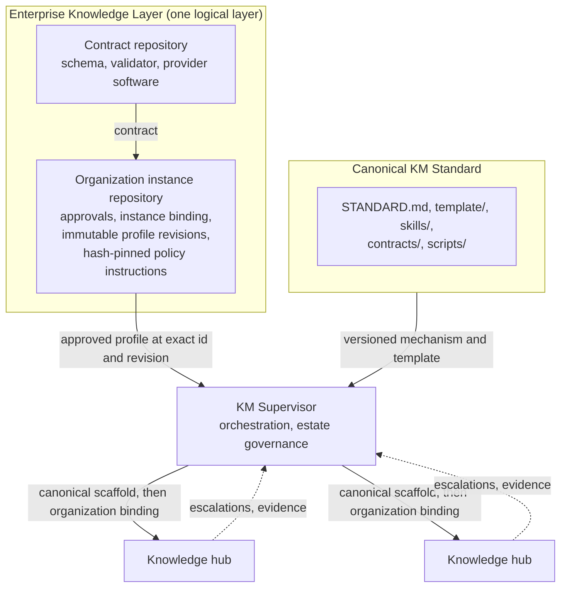

# Architecture Overview

The architecture separates mechanism, organization policy, orchestration, and knowledge into
distinct layers. Each layer has one owner and one kind of truth. No layer manufactures the truth
that belongs to another.

## The layers

### Canonical KM Standard

The canonical repository holds the organization-neutral mechanism: `STANDARD.md`, the reference
`template/`, the workspace and hub skills, the OrganizationProfile contract, and the dependency-free
profile validator. It contains no organization names, no organization policy, and no deployment
paths. It is versioned, and a published version number is never reused. Any organization can adopt
it unchanged, and every hub records exactly which canonical version and Git revision produced it.

### Enterprise Knowledge Layer

The Enterprise Knowledge Layer is one logical layer built from two repositories.

| Repository | Holds |
|---|---|
| Contract repository | The generic contract and software: the OrganizationProfile schema, validation and provider code. No organization data. |
| Organization instance repository | The governed organization instance: approval records, instance binding, immutable OrganizationProfile revisions, and hash-pinned policy instructions. |

The split keeps mechanism reusable and policy governed. The contract repository can be shared
across organizations. The instance repository belongs to one organization and is the only place its
profiles, approvals, and policy instructions live. The layer owns each profile's identity,
revision, approval record, effective date, enterprise namespace, contract revision, policy
references, and module eligibility decisions.

### KM Supervisor

The Supervisor orchestrates the estate. It routes cross-hub sources, holds shared identity, runs
escalations, and deploys hubs. During deployment it resolves one approved OrganizationProfile from
the configured Enterprise Knowledge Layer, verifies it, applies only its declared operations, and
records the binding in the hub. The Supervisor consumes enterprise truth; it never creates it. It
effects hub content changes only through each hub's own proposal and approval flow.

### Knowledge hubs

Each hub holds purpose-specific knowledge for one initiative, governed by the standard's six rules:
inbox-first intake, proposal and approval for every doc change, Git-backed integrity, OKF
frontmatter, source traceability, and — since v1.22 — the record boundary: records stay in the
systems that master them, and the hub holds claims about records with resolvable pointers, never
shadow copies of operational data. Hubs own their local knowledge and adopt standard changes
under their own governance. They never mint enterprise identity; an unrecognized shared entity is
escalated to the Supervisor instead.

### Systems of record (below every hub, since v1.22)

The layer the standard governs *against* rather than *owns*: the ERP, CRM, HRIS, finance system,
document store, ticketing system, transcription service, identity provider — wherever an
operational record is mastered. Hubs never replicate this layer; what may cross from it into a hub
is governed by Rule 6's four crossing laws, and the crossing itself — today the manual inbox +
date gate + reconciliation, optionally a connector — is the SoR gateway. See
[`05-the-record-boundary.md`](05-the-record-boundary.md).

## Diagram



## The vertical stack (v1.22)

The diagram above shows the *governance* layers — who owns which repository of truth. The record
boundary adds an orthogonal, *data-altitude* view of the same estate:

```
L4  Consumers          humans · agents · factories · briefs/publications
L3  Domain hubs        per-project / per-domain governed hubs
L2  Supervisor         routing · ontology stewardship · cross-hub reconciliation · SoR registry
L1  SoR Gateway        connectors · classification · claim extraction · freshness · access mediation
L0  Systems of record  ERP · CRM · HRIS · finance · DMS · ticketing · transcription · IdP
```

L1 needs no software to exist: the inbox, the date gate, and reconciliation are the gateway,
operated manually, and remain its reference implementation. Rule 6 names what they enforce.

## The entity types

A hub's typed knowledge lives as one note per instance, in nine entity types: five core
(`Stakeholder`, `Partner`, `Milestone` — grounded in schema.org — and the proprietary `Decision`
and `Risk`) and four optional (`RelationshipAssertion`, `Correction`, and since v1.22
`SourceSystem` — grounded in `dcat:DataService` — and `Claim`). The grounding split is deliberate:
open-standard common ground where the concept is solved, proprietary vocabulary where the
knowledge is the organization's own. See the Ontology & Entity Layer in `STANDARD.md`.

## Authority flow

Authority flows downward and evidence flows upward.

- The canonical standard defines obligations and mechanism. It approves nothing about any
  organization.
- The institutional authority approves each OrganizationProfile revision. The approval is a record
  in the organization instance repository, not a runtime judgement.
- The Supervisor acts only on an approved, effective, compatible profile resolved at an exact
  revision. It cannot approve, amend, or substitute one.
- Hubs record the canonical revision and, when bound, the profile revision that produced them in
  `km-deployment.md`. That record is what audits and scans check.
- Lessons learned in hubs travel upward as corrections and promotion handovers. They are evidence
  for changing the standard, never authority to change it.
