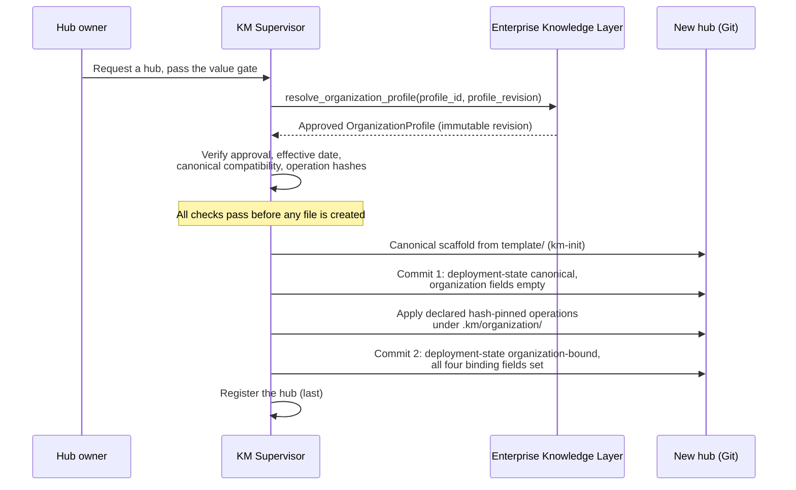

# Canonical-First, Profile-Second Hub Deployment

Every hub begins from the canonical standard and only afterwards receives organization
customization. The two steps are two separate, auditable Git commits. A reader of the hub's history
can see exactly what the canonical standard produced and exactly what the organization profile
added, and can verify each against its pinned revision.

## The protocol

1. Value gate. `km-init` starts by requiring three to five competency questions the hub must
   answer, each tied to a decision it serves or a cost it avoids. If the owner cannot produce them,
   no hub is created.
2. Resolve. The Supervisor requests one approved OrganizationProfile from the configured Enterprise
   Knowledge Layer through a provider interface, at an exact profile id and profile revision. There
   is no default profile and no newest-revision fallback.
3. Verify. Before any file is created, the Supervisor validates the resolved profile: schema shape,
   approval record, lifecycle, effective date, the canonical compatibility range against the exact
   canonical version in use, and the declared sha256 of every operation source. Authority,
   compatibility, and hashes are all settled before scaffolding begins.
4. Canonical scaffold commit. `km-init` copies `template/`, records the canonical version, full Git
   revision, and source in `km-deployment.md` with `deployment-state: canonical` and all four
   organization and enterprise fields empty, runs the canonical scan, and makes the first commit.
   This commit is organization-neutral and valid on its own.
5. Apply declared operations. The Supervisor applies only the operations the profile declares:
   hash-pinned `add` operations targeting `.km/organization/`, and `module` operations that carry an
   eligibility record. Nothing outside the declared operations changes.
6. Organization-bound customization commit. The Supervisor sets
   `deployment-state: organization-bound` and populates all four binding fields:
   `organization-profile-id`, `organization-profile-revision`, `enterprise-namespace`, and
   `enterprise-contract-revision`. This is the second commit.
7. Registration last. The hub is registered as organization-bound only after the customization
   commit exists and verifies. Registration never precedes the state it describes.

## Adopting a directory that already exists (v1.28)

Step 4 above describes the scaffold path, where `km-init` creates a hub at a path that holds
nothing. A deployment adopting this standard onto directories it did not create enters at the same
protocol through the skill's **adoption mode**: the value gate and the purpose interview run
unchanged, and the pass then writes only what the directory lacks — the hub definition and its
interview stamp, the scope guard, the registry row, and any scaffold files that are absent. It
never overwrites existing content, and it preserves the canonical provenance the binding already
records, because a hub records the revision it was built from and re-pinning it is a separate
governed act. Steps 2, 3 and 5 to 7 are unchanged: an adopted hub that is to become
organization-bound goes through the same resolve, verify and customization-commit sequence, in its
own second commit. See STANDARD.md → "A gate needs a route back".

## Sequence diagram

## Fail-closed behavior

Validation fails closed. Each condition below stops the deployment before customization. None of
them produces a partial hub, an organization-ready claim, or a registration.

| Condition | Detected at | Result |
|---|---|---|
| Provider unavailable | Resolution | No profile is resolved. Customization does not start. |
| Profile not approved, or lifecycle not `active` | Verification | Rejected before customization. |
| Canonical version outside the profile's compatibility range | Verification | Rejected before customization. |
| Profile not yet effective (`effective_date` in the future) | Verification | Rejected before customization. |
| Overreaching operation: target outside `.km/organization/`, unsafe path, hash mismatch, unsupported kind, or module without an eligibility record | Verification | Rejected before customization. |

A failure after the canonical scaffold commit leaves that verified canonical commit intact. The hub
remains a valid canonical hub with `deployment-state: canonical` and empty organization fields. It
is never left half-customized and is never registered as organization-bound.

## Mechanical enforcement

The hub's own scan enforces the binding invariants recorded in `km-deployment.md`:

- `canonical-standard-revision` must be a full 40-character lowercase Git revision.
- A `canonical` deployment must have all four organization and enterprise fields empty.
- An `organization-bound` deployment must have all four fields populated.
- `initiation-interview` must carry a date (v1.25). A hub with no interview record is quarantined
  and never scans green; the adoption mode above is how an existing directory gets one.
- `routing-keywords` must be substituted and non-empty (v1.28), checked only once the interview
  date is valid, so an uninterviewed hub reports one defect rather than two.

The canonical test `tests/test_hub_deployment_binding.sh` proves each of these cases, including
both failure directions: organization values on a canonical hub and missing values on an
organization-bound hub.

**Draft rider (v1.23, not yet binding):** the binding file also hosts optional, commented hub
*species* fields — `station` (governs intake) and `exposure` (governs output), with compartment
audience/boundary declarations beside them. Absent fields default to `station: domain`,
`exposure: compartment`, and the scan validates the enums only when the fields are present; the
same test file proves that declared valid values pass and an out-of-enum value fails. The
obligations behind these fields bind nothing until v1.23 publishes — see
[`06-stations-compartments-resolution.md`](06-stations-compartments-resolution.md).
