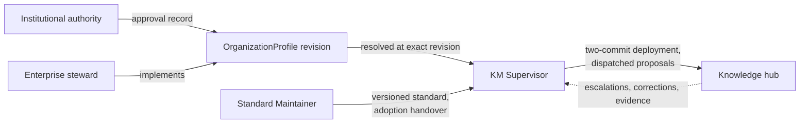

# Authority Boundaries

The architecture works because each actor's authority stops where the next actor's begins, and
because every act is recorded in the scope of the actor that performed it. This document lists the
boundaries and how each is evidenced.

## The boundaries

| Actor | Does | Does not |
|---|---|---|
| Institutional authority | Approves each OrganizationProfile revision. The approval is a record with an id and a date, held in the organization instance repository. | Does not implement profiles or operate deployments. |
| Enterprise steward | Implements profiles, enterprise records, and policy instructions in the organization instance repository. | Cannot self-approve. A profile the steward wrote but the authority has not approved is not resolvable. |
| KM Supervisor | Orchestrates the estate: routing, shared identity, escalations, hub deployment. Resolves and applies approved profiles and registers hubs. | Never manufactures enterprise truth. Never approves a profile. Never edits hub content directly; content changes go through each hub's own proposal flow. |
| Knowledge hub and its agent | Owns local knowledge under the six governance rules. Applies changes under its own approval flow. | Never mints enterprise identity. An unrecognized shared entity is escalated, not created locally. Never holds records that a system of record masters — claims and pointers only (Rule 6). |
| Standard Maintainer | Evolves and versions the canonical standard and hands adoption to the Supervisor. | Does not apply standard changes to hubs. Adoption is each hub owner's decision, recorded in that hub's history. |

## Attribution is not approval

Every agent commit carries a `KM-Agent:` trailer, and a dispatched commit also carries
`Dispatched-By:`. These trailers record execution identity: which agent actually acted, and on
whose dispatch. They make an unenforceable scope boundary observable after the fact.

They are never approval evidence. Approval lives in its own artifacts: the approval record inside a
profile, the approval file in a hub's `changes/`, the owner's instruction to the Standard
Maintainer. A trailer proves who executed a change. It proves nothing about whether the change was
authorized, and no check treats it as if it did.

## Cross-runtime agent parity

Agent roles ship as one shared contract per role, with thin adapters for each runtime. The Claude
and Codex adapters supply runtime-specific metadata and tool wiring only; they grant no authority
beyond the shared contract. Adapter syntax may differ, but authority sources, classification,
write boundaries, validation results, attribution, and stopping points must remain semantically
identical across runtimes.

The same parity holds in the hub template: each per-hub skill exists once for Claude Code under
`.claude/skills/` and once for AGENTS.md-compatible tools under `.agents/skills/`, with the same
content apart from runtime-specific file references. Parity checks compare the two so that neither
runtime quietly gains capabilities or loses obligations the other has.
