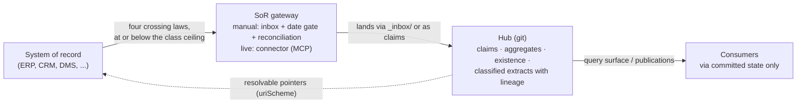

# The Record Boundary

Published as **v1.22** (2026-08-16). Normative text: `STANDARD.md` → Governance Layer → Rule 6 and
the Ontology & Entity Layer; full rationale, migration notes, and design decisions:
[`rfcs/RFC-001-sor-gateway.md`](../../rfcs/RFC-001-sor-gateway.md) (adopted).

## The problem the boundary names

A hub is not a data store. The moment it holds copies of operational records — CRM rows, ledger
entries, personnel files, contact databases — it becomes a shadow system: unowned, unrefreshed,
and invisible to the access controls of the system the records actually live in. Every governance
control before v1.22 measured whether a hub was *consistent*; none said what a hub may *hold*.

Rule 6 says it: **records stay in systems of record; hubs hold claims about records**, each with a
resolvable pointer back. The rule was discovered operationally — in an engagement organizing a
partner organization's complete internal knowledge export (~12,000 files) into a governed hub —
not designed in advance, and the standard's existing machinery turned out to already enforce it by
hand: the inbox, the date gate, and reconciliation *are* the gateway between systems of record and
the hub. v1.22 names the boundary they were always protecting and gives it a schema.

## The four crossing laws

| Law | Crosses | Does not cross |
|---|---|---|
| 1 | **Claims** — "the contract commits us to X, at `<uri>`" | The contract itself |
| 2 | **Aggregates** — a total computed across a ledger | The ledger's line items |
| 3 | **Existence** — that a database exists: size, owner, location | Its rows |
| 4 | When a copy is unavoidable (pointer rot, survivability): **the classified extract, with lineage** — source pointer, extraction date, access class | Anything beyond the fidelity its access class permits |

The governing principle for any automation at this boundary: **detection, extraction, and
freshness automate; classification and resolution authority stay with the owner** — the same
division reconciliation already draws.

## `accessClass`

An optional frontmatter field on any hub document or entity note:
`public | internal | restricted | record`, defaulting to `internal` when absent. `record` marks
catalogue entries whose referent must never be reproduced in hub content. Derivations from
`restricted` material inherit `restricted`; declassification follows one rule — **aggregation
declassifies; extraction does not**.

Enforcement is mechanical and classification-aware (`[ RESTRICTED ]` in `hub-scan.sh`): the body
text of a classed note is blocked verbatim on outbound surfaces while its **name stays nameable**,
because existence crosses (law 3) — a `record`-class catalogue entry exists precisely so the hub
can name a record without reproducing it. Verbatim matching enforces the declassification rule by
construction: an aggregate is not a verbatim line of any classed note, so it passes; an extracted
line is, so it fails. The older `sensitivity: restricted` marker is complementary, not superseded:
it remains the mechanism for a note whose *name or existence* is itself sensitive.

## Two entity types

| Type | Home | Grounding | Job |
|---|---|---|---|
| `SourceSystem` | `sources/systems/` (per-hub) | `dcat:DataService` | One note per connected system of record: kind, uri scheme, connector route, default access class, refresh policy, owner. The system-level contract behind the per-source date register, and — where connectors exist — the connector's declarative manifest. |
| `Claim` | `claims/` | proprietary | A settled fact promoted to a first-class note when it needs an independent lifecycle, an evidence chain (`evidencedBy` → `prov:wasDerivedFrom`), a validity window, or a stable cross-hub identity. Reconciliation remains the adjudication process; promotion is never mandatory. |

## Bitemporal validity

Three optional fields on any note separate world-time from record-time: `validFrom` /
`validUntil` (when the fact holds in the world; a lapsed window is a staleness candidate *by
declaration, not by guess*) and `recordedAt` (when the hub learned it). Lifecycle handles
supersession; validity handles **scheduled truth** — constraints with date ranges, exemptions that
expire, decisions overtaken by dated events.

## Inbound connectors: the mirror of the query surface

The MCP query surface is the hub's optional **outbound** interface; the connector model is its
**inbound** mirror. Outbound, the git commit is the publish boundary; inbound, the access class is
the crossing boundary.

In v1 (declarative) each `SourceSystem` note *is* the manifest; a hub whose connectors are all
`manual` is fully described, and **a hub built from a snapshot is the batch degenerate case of the
gateway** — a `vault-export` source with `refreshPolicy: none`, honestly declared. In v2 (live) a
connector declares its readable scope, class ceiling, cadence, and uri scheme; it is read-only by
default, everything lands via `_inbox/` or as claims with lineage, and raw records never cross. A
connector is a faster inbox, never a bypass. Delete every connector and the hub is unchanged.
