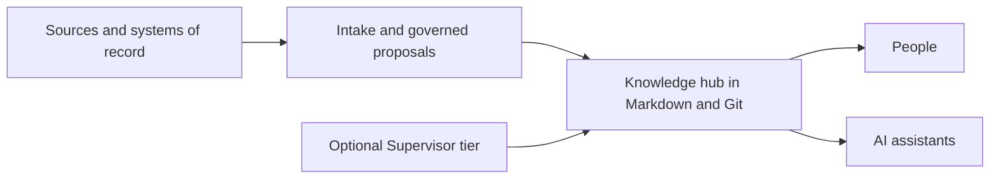

# KM Standard Glassity Front Door Implementation Plan

> **For agentic workers:** REQUIRED SUB-SKILL: Use superpowers:subagent-driven-development (recommended) or superpowers:executing-plans to implement this plan task-by-task. Steps use checkbox (`- [ ]`) syntax for tracking.

**Goal:** Rebuild the repository front door as KM Standard - Glassity Edition, with equal adopter and maintainer entry paths, a versionless banner, concise baseline handling, and complete supporting documentation.

**Architecture:** Keep `STANDARD.md` and every governed implementation surface unchanged. Replace only the presentation layer: the root README, a deterministic SVG/PNG banner pair, four focused guide documents, a Glassity changelog, and repository metadata after the content is accepted. The direct release gate remains the authoritative final verdict.

**Tech Stack:** GitHub Flavored Markdown, SVG, PNG rendered with the bundled Node.js `sharp` package, Git, GitHub Actions, Python release gate.

---

### Task 1: Record the current presentation defects

**Files:**
- Read: `README.md`
- Read: `assets/km-banner.svg`
- Read: `assets/km-banner.png`
- Read: `STANDARD.md`

- [ ] **Step 1: Confirm the working branch and clean starting state**

Run:

```bash
git branch --show-current
git status --porcelain=v1 --branch
```

Expected: branch `codex/glassity-front-door`; no unstaged or untracked files after the committed implementation plan.

- [ ] **Step 2: Measure the long README release block**

Run:

```bash
sed -n '31,50p' README.md | wc -l -w -c
```

Expected baseline: 20 lines and 287 words.

- [ ] **Step 3: Prove the banner carries a stale mutable version**

Run:

```bash
rg -n 'V1\.22|v1\.22' assets/km-banner.svg
```

Expected baseline: the command finds `OPEN STANDARD · V1.22`.

- [ ] **Step 4: Preserve the authoritative baseline fact**

Run:

```bash
git rev-parse v1.64^{}
git rev-parse main
```

Expected: both commands resolve to `9d43e193d044e2bdd6084480b80195b7e8ba9adf`.

### Task 2: Build the versionless Glassity banner

**Files:**
- Modify: `assets/km-banner.svg`
- Modify: `assets/km-banner.png`

- [ ] **Step 1: Update the editable SVG source**

Edit the existing SVG rather than replacing its visual system. Preserve the 2048 by 672 canvas and dark navy, teal, coral, and gold palette. Make these exact copy changes:

```text
OPEN STANDARD · V1.22
→ GLASSITY EDITION

KM Standard
→ KM Standard

Governed, agent-readable knowledge in plain files.
→ Governed knowledge hubs in plain Markdown and Git.

“Claims cross; records don’t.”
→ Built for people and AI assistants.

THE RECORD BOUNDARY
→ PORTABLE · AUDITABLE · GOVERNED

supervisor
→ governed flow
```

Keep the knowledge-hub nodes, record-system symbols, and flow lines as the architecture motif. Remove every version token from the SVG.

- [ ] **Step 2: Render the PNG from the SVG source**

Run:

```bash
NODE_PATH=/Users/cjgama/.cache/codex-runtimes/codex-primary-runtime/dependencies/node/node_modules \
  /Users/cjgama/.cache/codex-runtimes/codex-primary-runtime/dependencies/node/bin/node \
  -e "const sharp=require('sharp'); sharp('assets/km-banner.svg').resize(2048,672).png().toFile('assets/km-banner.png').catch(e=>{console.error(e);process.exit(1)})"
```

Expected: exit 0 and `assets/km-banner.png` reports 2048 by 672 pixels.

- [ ] **Step 3: Verify the banner source is versionless**

Run:

```bash
rg -n 'v[0-9]+\.[0-9]+|V[0-9]+\.[0-9]+' assets/km-banner.svg
```

Expected: exit 1 with no matches.

- [ ] **Step 4: Inspect the rendered PNG**

Open `assets/km-banner.png` with the image viewer. Confirm the title, edition mark, supporting line, and architecture illustration are legible; no version appears; no text is clipped.

### Task 3: Create the Glassity documentation paths

**Files:**
- Create: `CHANGELOG.md`
- Create: `docs/README.md`
- Create: `docs/adopting.md`
- Create: `docs/maintaining.md`
- Create: `docs/license-and-reuse.md`

- [ ] **Step 1: Create `CHANGELOG.md`**

Use these headings and baseline statement:

```markdown
# Changelog

This changelog records Glassity Edition changes. The inherited KM Standard release ledger remains authoritative in [`STANDARD.md`](STANDARD.md#version-history).

## Inherited baseline - 2026-08-27

Glassity Edition begins from published KM Standard v1.64 at commit `9d43e193d044e2bdd6084480b80195b7e8ba9adf`.

No Glassity release number is assigned at the baseline. The first Glassity version will be assigned only when this edition introduces an accepted divergence from the inherited Standard.
```

Add a short three-bullet summary linking to the v1.64 version ledger rather than duplicating its full narrative.

- [ ] **Step 2: Create `docs/README.md`**

Use these sections:

```markdown
# Documentation

## Start here
- Adopting the Standard
- Maintaining and evolving the Standard
- Normative Standard

## Architecture
- Current authority
- Historical v1.22 architecture snapshot

## Design and change records
- RFC index
- OpenSpec change records
- Glassity front-door design and implementation plan
```

Every entry is a relative link. Label `docs/architecture/` as historical and route current authority to `../STANDARD.md`.

- [ ] **Step 3: Create `docs/adopting.md`**

Cover exactly:

1. What an adopter gets.
2. How to evaluate fit.
3. How to initialize one hub with `skills/km-init/SKILL.md` or by copying `template/`.
4. How daily operation uses `_inbox/`, `changes/`, entity notes, and `hub-scan.sh`.
5. When the optional Supervisor tier becomes relevant.
6. The boundary between the inherited v1.64 Standard and Glassity Edition presentation.

Keep the operational commands consistent with the existing README and link to the normative sections rather than restating their obligations.

- [ ] **Step 4: Create `docs/maintaining.md`**

Cover exactly:

1. Maintainer authority and the role of `agents/km-hub-builder/`.
2. `STANDARD.md` as normative authority.
3. RFCs as dated design records.
4. `openspec/changes/` as accepted change evidence.
5. The direct command `python3 tools/km-release-gate.py` as the authoritative gate.
6. The rule that a cache may accelerate feedback but never produces the authoritative verdict.
7. The required red-before-repair and verification-declaration discipline.

- [ ] **Step 5: Create `docs/license-and-reuse.md`**

Move the detailed Apache-2.0 explanation from the existing README without changing its legal meaning. Preserve these facts:

- use, adaptation, forking, and redistribution are permitted under Apache-2.0;
- redistributed derivatives must preserve notices, include the license, mark changes, and carry `NOTICE`;
- internal use without redistribution does not trigger the redistribution conditions;
- the repository license does not impose a license or commercial model on deployed knowledge hubs;
- `LICENSE` governs if the summary differs, and the summary is not legal advice.

### Task 4: Rewrite the README front door

**Files:**
- Modify: `README.md`

- [ ] **Step 1: Replace the opening through the package inventory**

Use this exact top-level identity:

```markdown
# KM Standard - Glassity Edition

A governed knowledge-hub framework for people and AI assistants, built in plain Markdown and Git.

**Glassity Edition - based on KM Standard v1.64**

[Adopt the Standard](docs/adopting.md) · [Evolve the Standard](docs/maintaining.md) · [Read the Standard](STANDARD.md) · [Documentation](docs/README.md)
```

Keep the versionless PNG banner above the H1. Keep four trust signals only:

1. inherited baseline badge using `assets/badges/version.svg`;
2. live release-gate status badge linked to `.github/workflows/release-gate.yml`;
3. `assets/badges/license.svg`;
4. `assets/badges/format.svg`.

Use alt text `KM Standard - Glassity Edition: governed knowledge hubs in plain Markdown and Git` for the banner.

- [ ] **Step 2: Add the two equal entry paths**

Create adjacent subsections titled `Adopt the Standard` and `Evolve the Standard`. Each gets one short paragraph and one primary link. Neither section may contain more than 90 words.

- [ ] **Step 3: Add product and architecture sections**

Add `Why this exists`, `What you get`, and `How it works` before either quick start. Use a compact Mermaid flowchart with these nodes and labels:



State explicitly that source records remain in their systems of record and that the hub governs retained evidence, claims, decisions, and working knowledge.

- [ ] **Step 4: Condense quick starts and repository map**

Retain a five-step adopter quick start, but link detailed guidance to `docs/adopting.md`. Add a short maintainer quick start linking to `docs/maintaining.md`, `agents/km-hub-builder/`, the RFC index, and the release gate. Replace the long package table with a compact map of `STANDARD.md`, `template/`, `skills/`, `components/`, `rfcs/`, `openspec/changes/`, and `tests/`.

- [ ] **Step 5: Replace detailed legal prose with an operational summary**

The root README license section contains no more than two paragraphs and links to `docs/license-and-reuse.md`, `LICENSE`, and `NOTICE`.

- [ ] **Step 6: Verify the README no longer leads with release history**

Run:

```bash
sed -n '1,80p' README.md
rg -n 'second and final wave|nothing stays behind|queue row schema' README.md
```

Expected: the first command shows identity, paths, benefits, and architecture; the second exits 1 with no matches.

### Task 5: Verify presentation scope and repository integrity

**Files:**
- Verify: `README.md`
- Verify: `CHANGELOG.md`
- Verify: `docs/README.md`
- Verify: `docs/adopting.md`
- Verify: `docs/maintaining.md`
- Verify: `docs/license-and-reuse.md`
- Verify: `assets/km-banner.svg`
- Verify: `assets/km-banner.png`

- [ ] **Step 1: Check required identity and paths**

Run:

```bash
rg -n 'KM Standard - Glassity Edition|based on KM Standard v1\.64|Adopt the Standard|Evolve the Standard' README.md
```

Expected: all four concepts are present.

- [ ] **Step 2: Check versionless artwork and exact PNG dimensions**

Run:

```bash
rg -n 'v[0-9]+\.[0-9]+|V[0-9]+\.[0-9]+' assets/km-banner.svg
file assets/km-banner.png
```

Expected: the first command exits 1; the second reports 2048 by 672 PNG.

- [ ] **Step 3: Check Markdown links through the repository gate**

Run directly and unpiped:

```bash
python3 tools/km-release-gate.py
```

Expected: exit 0. Record the exit status explicitly. Do not treat timing output as the verdict.

- [ ] **Step 4: Check diff hygiene and scope**

Run:

```bash
git diff --check
git status --short
git diff --name-only main...HEAD
git diff --name-only
```

Expected: `git diff --check` exits 0; changed paths are restricted to the design, plan, README, changelog, four approved documentation files, and two banner assets.

- [ ] **Step 5: Confirm the canonical repository remains unchanged**

Run in `/Users/cjgama/KM-Standard/km-standard`:

```bash
git status --porcelain=v1 --branch
git rev-parse HEAD
```

Expected: clean `main...origin/main` at `9d43e193d044e2bdd6084480b80195b7e8ba9adf`.

### Task 6: Commit and publish the feature branch

**Files:**
- Commit only the approved paths from Tasks 2 through 5.

- [ ] **Step 1: Review the complete patch**

Run:

```bash
git diff -- README.md CHANGELOG.md docs/README.md docs/adopting.md docs/maintaining.md docs/license-and-reuse.md assets/km-banner.svg
git diff --stat
```

Inspect `assets/km-banner.png` separately as a binary asset.

- [ ] **Step 2: Stage exact paths**

Run:

```bash
git add -- README.md CHANGELOG.md docs/README.md docs/adopting.md docs/maintaining.md docs/license-and-reuse.md assets/km-banner.svg assets/km-banner.png
```

- [ ] **Step 3: Commit the implementation**

Run:

```bash
git commit -m "docs: redesign Glassity repository front door"
```

Expected: one implementation commit after the design and plan commits.

- [ ] **Step 4: Push the feature branch**

Run:

```bash
git push -u origin codex/glassity-front-door
```

Expected: the remote feature branch is created and upstream tracking is configured.

### Task 7: Apply GitHub metadata after content acceptance

**Repository setting:** `cjgama/km_standard_glassity`

- [ ] **Step 1: Confirm the content branch is accepted or merged**

Do not change repository metadata while the default branch still presents the old identity.

- [ ] **Step 2: Set the GitHub description**

Set exactly:

```text
Glassity's edition of an open, vendor-neutral standard for governed knowledge hubs built for people and AI assistants in Markdown and Git.
```

- [ ] **Step 3: Set the eight approved topics**

Set exactly:

```text
knowledge-management
knowledge-base
governance
markdown
git
ai-agents
knowledge-graph
open-standard
```

- [ ] **Step 4: Verify metadata without changing visibility or feature flags**

Expected: repository remains private; homepage remains unset; Discussions remain disabled.
