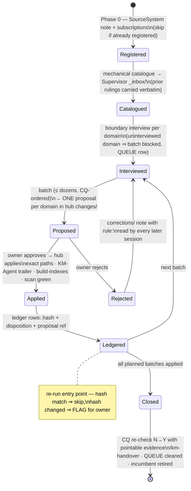

# feat: Add km-vault-upgrade estate skill

**Target repo:** `km_standard_glassity` (worktree `km_standard_glassity.feat-km-vault-upgrade`, branch `feat/km-vault-upgrade`). All paths below are repo-relative.

## Summary

Author one workspace-level skill — `skills/km-vault-upgrade/SKILL.md`, canonical-only like `km-supervise` — that turns the incumbent hand-written vault-ingestion plan into a reusable onboarding command: catalogue → boundary interviews → CQ-ordered batched extraction through the existing `/km-gather` / `/km-intake` / `/km-supervise` flows → idempotency ledger → evidenced close. Ships with a campaign-ledger format contract, a factory-side format test (red-first), and an openspec change package.

---

## Problem Frame

Onboarding a large Obsidian vault into a KM estate today requires an owner to hand-write a phased plan and hand-build a catalogue (the incumbent: `~/km/_KM_Supervisor/vault-ingestion-plan.md`, 977-line catalogue). The origin document maps `/om-vault-upgrade`'s import mechanics onto KM governance and names eight gaps (GAP-1…8) neither system covers. The factory ships no onboarding command; the bulk-corpus shape it prescribes (STANDARD.md §3902–3905) has no skill implementing it.

---

## Requirements

- R1. Skill generates the per-file catalogue mechanically (date, date-source, knowledge/record class, candidate route, exclusion flag), leaving only rulings to the owner (origin GAP-1)
- R2. Extraction routes per-fact tuples (claim, source, locator, evidence), so mixed files can feed multiple hubs (GAP-2)
- R3. Entity minting computes edge closure per batch — every wikilink target exists or is minted in the same proposal, `[ LINKS ]` passes on apply (GAP-3)
- R4. Campaign state is resumable across sessions: batches tracked as proposed / approved / applied / rejected, ordered by competency questions (GAP-4)
- R5. Rejected proposals produce `corrections/` notes with durable `rule:`; subsequent batch sessions read active corrections first (GAP-5)
- R6. Re-runs against a live vault are safe: an idempotency ledger (source path + content hash + disposition + proposal ref) skips adjudicated sources and flags changed ones; ledger adoption at an estate is a governed act (GAP-6)
- R7. Duplicate subtrees get source-of-record selection + per-diff reconciliation, never silent dedupe (GAP-7)
- R8. Every extract inherits SourceSystem `defaultAccessClass` unless the boundary interview restricts it; restricted material never reaches indexes or `shareable/` (GAP-8)
- R9. The skill never writes entity folders directly — all content mutations arrive as proposals in the receiving hub's `changes/`
- R10. Existing owner rulings in a prior catalogue are carried forward verbatim, never re-derived
- R11. The skill lands under factory governance: openspec package, discovered tests pass, release gate green

**Origin flows:** Episode I (registration & catalogue), II (interviews & batch planning), III (extraction under governance), IV (integrity & idempotency), V (close)
**Origin acceptance examples:** the GIVEN/THEN bullets under each episode (cited per-unit below as AE-I…AE-V)

---

## Scope Boundaries

- No template mirrors, no per-hub distribution — estate skill, canonical-only (parity test exempts single-location slugs)
- No STANDARD.md normative edit and no version bump in this change; publication is the owner's separate decision
- No execution of the campaign against the real vault (that is post-merge estate work under the incumbent plan)
- Skill orchestrates existing flows; it never bypasses proposals, copies records into hubs, or modifies the source vault
- Origin deferrals honored: Notion campaign specifics, cockpit rendering of campaign rows, semantic-layer identity minting
- Incumbent plan's unresolved questions (duplicate authority, meeting extraction depth, cadence) are answered by the owner during boundary interviews at execution time

### Deferred to Follow-Up Work

- Mechanical ledger validator run at estate scope (a skill asset script): follow-up once the format survives one real campaign — the factory-side format test (U5) is the v1 guard
- MCP/automation hooks for catalogue generation beyond what the skill instructs an agent to do inline

---

## Context & Research

### Relevant Code and Patterns

- `skills/km-supervise/SKILL.md` — estate-scope skill shape: governing principles block, `--dry-run` mode, stepped owner Q&A, dispatch-not-apply, refusal patterns
- `skills/km-init/SKILL.md` — value gate, interview discipline, "look before asking" pre-fill rules, tier-minting interplay
- STANDARD.md §3902–3905 — the bulk-corpus doctrine this skill implements (catalogue → boundary interview → domain split → one proposal per domain)
- STANDARD.md §4349–4373 — import-package contract: one canonical machine-readable JSON, match hints, validator gates intake not truth
- RFC-002 / `docs/architecture/06-stations-compartments-resolution.md` — `_scratch/` plane for bulk working state (git-ignored, stated lifetime)
- STANDARD.md v1.64 "arrival is not a decision" — intake runs to completion unasked; only proposals (and the date gate) hold on the owner
- `openspec/changes/promote-external-build-mechanisms/` — package shape: proposal.md (Why/What Changes/Impact), design.md, tasks.md (base-commit pin, phases), specs/<capability>/spec.md (ADDED / SHALL / Scenario WHEN-THEN)
- `tests/test_ledger_dates.sh` + `scripts/validate_ledger_dates.py` — precedent for mechanically validating a ledger format
- Live incumbent artifacts (execution-side references, not in this repo): `~/km/_KM_Supervisor/vault-ingestion-plan.md`, `_inbox/vault-catalogue-2026-08-31.md`

### Institutional Learnings

- No `docs/solutions/`; learnings live in the version ledger and openspec packages. Directly applicable: skill frontmatter is two fields, trigger-phrased (v1.27, from an 81-of-82-file defect); the one skill copy without a parity check was the one that drifted; hand-maintained ledgers without validators are the documented failure mode; bulk imports "require their own governed amendment" (glassity ad-003)

### External References

- Origin: `/Users/ernesto/obsidian-mind/reference/km-vault-upgrade-gap-plan.md` (requirements + User Story Spec)
- Contract map: `/Users/ernesto/obsidian-mind/reference/om-km-contract-equivalency.md` (fidelity ratings; ✅ rows port mechanically, ⚠️ rows need extraction logic + rulings, ❌/➕ rows = GAP list)

---

## Key Technical Decisions

- **Skill class: workspace-level, canonical-only** (like `km-init`/`km-supervise`): the campaign is estate work run at the Supervisor. Consequence: no mirror copies, `test_skill_distribution_parity.sh` exempts it, `test_readme_inventory.sh` untouched; only README's untested `skills/` prose row is extended.
- **Ledger = import-package contract instance**: one canonical JSON file at the estate Supervisor (`_KM_Supervisor/campaign-ledger.json` when adopted), rows of `{source_path, content_hash, disposition, proposal_ref, batch_id, decided_on}`. Match hints, not duplicate records. The skill *instructs* its adoption under the tier's generic change rule — owner authorization in session plus a git commit stating the reason — and never creates estate state silently. (The growth-conditions table names six capabilities and not this one; adding a seventh row to `skills/km-supervise/_KM_Supervisor_template/README.md` is deliberately left to the follow-up that ships the estate-side validator, so this change keeps existing skills untouched.) Rationale: STANDARD §4349–4373 exists for exactly this; inventing a second format would be the drift the repo documents.
- **Catalogue format standardized from the incumbent's**: same columns (domain, file, date, date-source, class, route) plus an explicit rulings section carried forward verbatim on re-catalogue (R10). The incumbent catalogue becomes the first valid instance retroactively.
- **Working state in `_scratch/`**: batch staging, extraction intermediates, and dry-run routing tables are declared-lifetime scratch; only the ledger, catalogue, and proposals touch governed trees (RFC-002 doctrine).
- **"Arrival is not a decision" preserved**: the skill never pauses per file. Holds are exactly: date gate (mtime-only sources), boundary interview per domain (blocked batch = QUEUE row), and per-domain proposal approval.
- **Episode V lifecycle conflict resolved**: incumbent retires with `lifecycle: retired` (its post-review text), overriding origin's `superseded` per origin's own precedence rule ("the plan's owner rulings win").
- **No new gate check beyond the format test**: SKILL.md is auto-covered by frontmatter test + gate link resolution + fingerprinting; only the ledger format warrants a new discovered test.

---

## Open Questions

### Resolved During Planning

- Where does the skill live? — Factory `skills/` (user: "include in the factory a future command"), operated at Supervisor tier. Both origin assumptions hold simultaneously.
- Does README need a row? — Only the prose `skills/` repository-map row (README.md:113); the tested per-hub parenthetical row (README.md:112) is untouched.
- Ledger validator now or later? — Factory-side *format* test now (U5); estate-side runtime validator deferred (see Deferred to Follow-Up Work).

### Deferred to Implementation

- Exact hash algorithm + normalization for `content_hash` (whitespace/frontmatter sensitivity): decide while writing the format contract with fixtures in hand
- Whether the catalogue is one file per campaign or append-per-run: decide when writing Episode I steps; either satisfies R10
- Precise wording of the skill's refusal/escalation blocks: drafted during SKILL.md authoring, mirroring km-supervise's register

---

## High-Level Technical Design

> *This illustrates the intended approach and is directional guidance for review, not implementation specification. The implementing agent should treat it as context, not code to reproduce.*

---

## Implementation Units

- U1. **openspec change package**

**Goal:** The governed wrapper: why the skill exists, what changes, capability spec.
**Requirements:** R11
**Dependencies:** None
**Files:**
- Create: `openspec/changes/add-km-vault-upgrade-skill/proposal.md`
- Create: `openspec/changes/add-km-vault-upgrade-skill/design.md`
- Create: `openspec/changes/add-km-vault-upgrade-skill/tasks.md`
- Create: `openspec/changes/add-km-vault-upgrade-skill/specs/vault-upgrade-campaign/spec.md`
**Approach:**
- proposal.md Why = the incumbent's hand-built cost + GAP list; What Changes = ADDED capability `vault-upgrade-campaign`; Impact = skills/, tests/, README; explicit not-in-scope = publication, estate execution
- spec.md requirements in SHALL + Scenario WHEN/THEN form, derived from origin Episodes I–V
- tasks.md pins the base commit and orders units U2→U6 with U5's failing-direction-first run explicit
**Patterns to follow:** `openspec/changes/promote-external-build-mechanisms/`
**Test scenarios:**
- Test expectation: none — governance documents; correctness is checked by review and by the gate's link/markdown passes
**Verification:** Package reads as a complete defect-free change story; all relative links resolve.

---

- U2. **Campaign ledger + catalogue format contract**

**Goal:** The machine-readable formats the skill reads/writes, defined once, with examples.
**Requirements:** R1, R6, R10 (AE-I, AE-IV)
**Dependencies:** U1
**Files:**
- Create: `skills/km-vault-upgrade/ledger-format.md` (format contract: JSON schema-by-example for ledger rows; catalogue column contract; **campaign-state table contract** — the catalogue header's batch table with columns batch-id, domain, CQs served, status enum `planned | proposed | approved | applied | rejected`, decided-on date, and the batch-id ↔ ledger-row correlation; disposition enum `extracted | pointer-only | rejected | out-of-scope | deferred`; FLAG semantics on hash change)
**Approach:**
- Follow STANDARD's import-package contract: one canonical JSON, no external parser deps, match hints over duplicates
- Document adoption as a governed act with the named growth condition; document `_scratch/` staging for everything else
- Content-hash normalization decided here with concrete examples (deferred question lands in this unit)
- The one-file-vs-append-per-run question resolves here too — the campaign-state contract cannot be written without it, and U4's resumability claim rests on it (R4)
- **One-definition rule:** the contract carries one machine-readable block (disposition enum + required row keys + status enum) that U5's test parses its assertions from — an edit to the contract reddens the test; prose elaborates, never redefines
**Patterns to follow:** STANDARD.md §4349–4373; `scripts/validate_ledger_dates.py` precedent for what a format test will assert
**Test scenarios:** (enforced via U5's test; enumerated there)
- Test expectation: none in this unit — the contract's tests ship in U5 against these examples
**Verification:** A reader can produce a valid ledger row and catalogue row from the contract alone.

---

- U3. **SKILL.md — campaign core (Episodes I–III)**

**Goal:** The skill's main body: invocation, registration, catalogue, interviews, batch planning, extraction orchestration.
**Requirements:** R1, R2, R3, R5, R8, R9, R10 (AE-I, AE-II, AE-III)
**Dependencies:** U2
**Files:**
- Create: `skills/km-vault-upgrade/SKILL.md`
**Approach:**
- Frontmatter: `name: km-vault-upgrade` + one trigger-phrased description sentence (10–40 words, names `/km-vault-upgrade <vault-path>`, no colon-space)
- Governing principles block up front (never write entity folders; owner decides routing; no bypass — mirroring km-supervise's three)
- Step 0 registration idempotent: detect existing SourceSystem note, skip or execute incumbent-Phase-0 shape (note, subscriptions, dates-registers) as owner-authorized commits
- Catalogue step: mechanical per-file rows; carry prior rulings verbatim (quote the rule: "rulings are carried forward, never re-derived"); excluded subtrees never proposed from
- Interview gate: uninterviewed domain blocks its batch and surfaces a QUEUE row; bulk-export subtrees quarantined as own campaigns
- Extraction: per-fact tuples; no locator+evidence = not routed; edge closure computed per batch (mint referenced stakeholders in the same proposal); accessClass from interview else SourceSystem default; mixed sources through `/km-supervise --dry-run` first; out-of-scope facts → `_unrouted/`, logged, never dropped
- Rejection loop: corrections note with durable `rule:` before proposal deletion; session start reads active corrections
**Execution note:** Draft against the live incumbent artifacts as the worked example — every step must be performable on the 2026-08-31 estate as it exists.
**Patterns to follow:** `skills/km-supervise/SKILL.md` (structure, refusals, dry-run), `skills/km-init/SKILL.md` (interview discipline, pre-fill rules)
**Test scenarios:**
- Happy path: frontmatter passes `tests/test_skill_frontmatter.sh` across its assertions (name = dir slug, trigger-phrased description)
- Integration: every relative link in SKILL.md resolves under the gate's `check_links`
- Test expectation for behavior: none mechanical — skill bodies are procedures; conformance is the U1 spec's Scenario list, exercised at first estate run
**Verification:** `bash tests/test_skill_frontmatter.sh` passes; skill reads as executable by an agent with no session context beyond the estate.

---

- U4. **SKILL.md — idempotency, re-run, close (Episodes IV–V)**

**Goal:** Complete the skill: ledger use, re-run semantics, duplicate reconciliation, campaign close.
**Requirements:** R4, R6, R7 (AE-IV, AE-V)
**Dependencies:** U3
**Files:**
- Modify: `skills/km-vault-upgrade/SKILL.md`
**Approach:**
- Every apply: exact-path staging, `KM-Agent:` trailer, `build-indexes.sh`, `hub-scan.sh` green — stated as the apply contract, citing Rule 3
- Re-run: ledger hash match ⇒ skip; changed ⇒ FLAG row for owner (om's FLAG behavior); ledger adoption instructions (governed act) inline
- Duplicates: source-of-record selection by owner, per-diff reconciliation through disputes — never silent dedupe
- Close: CQ re-check N→Y only with pointable facts; `/km-handover` per hub; QUEUE ingestion rows cleared; incumbent plan retired `lifecycle: retired` pointing at the closing commit
- Campaign state table (batch → proposed/approved/applied/rejected) lives in the catalogue file's header, updated per session — resumability without new state files
**Patterns to follow:** incumbent plan Phase 6 (as amended 2026-08-31); origin Episode IV/V bullets
**Test scenarios:**
- Test expectation: none — same rationale as U3; re-run semantics are covered by U5's format-level dispositions and the U1 spec scenarios
**Verification:** A cold-start session can resume a half-done campaign from the catalogue header + ledger alone.

---

- U5. **Ledger format test (proven both directions)**

**Goal:** A discovered factory check that the ledger/catalogue format contract cannot drift silently.
**Requirements:** R6, R11
**Dependencies:** U2
**Files:**
- Create: `tests/test_vault_upgrade_ledger_format.sh`
**Approach:**
- Assertions parsed from ledger-format.md's machine-readable block (one-definition rule, per U2); inline fixtures: valid ledger JSON, then mutations (missing disposition, unknown enum value, non-hash content_hash, duplicate source_path rows; campaign-state rows with an unknown status)
- New-check doctrine, not defect-repair doctrine: the suite **ships green**, proving both directions internally — valid fixture passes, each named mutation fails with a rule-specific message. The failing direction is RUN first and that run is recorded in the declaration's result text (the form `test_release_gate.sh`'s own fixture declaration uses). No manufactured red commit — there is no defect and no unrepaired tree here
- Declaration: `km-unrepaired-tree: none | <reason>` — no version is drafted in this change (H1 is published v1.64; declaring `v1.64` would falsely claim membership in a published version's ledger; `unrecorded` fails the gate on an added check)
- Also carries km-init-precedent literal conformance cases (pattern: `tests/test_hub_merge.sh`, each matcher proven live against its own literal) for the skill's load-bearing declarations: never-write-entity-folders, rulings carried forward verbatim, no silent dedupe
- States its own coverage and limits on the passing run (repo convention: "a recorded pass that does not state those is void")
**Execution note:** Run the failing direction first against a violating fixture; record that run in the declaration's result text. The suite lands green.
**Patterns to follow:** `tests/test_ledger_dates.sh` (structure, refusal exit codes, coverage statement)
**Test scenarios:**
- Happy path: valid fixture passes and prints coverage
- Error path: each named mutation fails with a rule-specific message
- Edge case: empty ledger (zero rows) is valid; ledger with only FLAG rows is valid
- Error path: unreadable/truncated JSON ⇒ refusal (exit 2), not pass
- Integration: SKILL.md literal conformance — each load-bearing declaration string present, each matcher proven live
- Error path: contract's machine-readable block edited (enum value renamed) ⇒ test reddens without touching fixtures
**Verification:** Test discovered and green under `python3 tools/km-release-gate.py`; declaration records the fixture-direction run; both directions demonstrably exercised in the suite itself.

---

- U6. **Surface updates + gate verification**

**Goal:** The factory's own inventory reflects the new skill; the whole tree passes the gate.
**Requirements:** R11
**Dependencies:** U3, U4, U5
**Files:**
- Modify: `README.md` (extend the `skills/` repository-map row prose with initialization/supervision/vault-onboarding phrasing)
**Approach:**
- Only the untested prose row (README.md:113) changes; the tested per-hub parenthetical row (README.md:112) is untouched
- Direct gate run recorded with exit status per docs/maintaining.md; exact-path staging throughout
**Patterns to follow:** README repository-map row style
**Test scenarios:**
- Test expectation: none — README prose; `tests/test_readme_inventory.sh` must remain green (it derives from template trees, which this change does not touch)
**Verification:** `python3 tools/km-release-gate.py` exits 0 on the working tree; `tests/test_readme_inventory.sh`, `test_skill_frontmatter.sh`, `test_skill_distribution_parity.sh` all pass.

---

## System-Wide Impact

- **Interaction graph:** New skill orchestrates `/km-gather`, `/km-intake`, `/km-supervise` — it must not duplicate their steps, only sequence them; any behavioral change to those flows is out of scope
- **Error propagation:** Skill-level failures surface as QUEUE rows or `_unrouted/` entries — never silent drops; refusals mirror km-supervise's escalation register
- **State lifecycle risks:** The ledger is new estate state — adoption is a governed act; `_scratch/` staging prevents partial-batch debris in governed trees
- **API surface parity:** None — canonical-only skill; parity machinery deliberately not engaged
- **Integration coverage:** The U1 spec's WHEN/THEN scenarios are the cross-flow contract; first real campaign (post-merge, estate-side) is the integration proof
- **Unchanged invariants:** STANDARD.md untouched; template/ untouched; existing skills untouched; Rule 3 staging discipline and the proposal flow are consumed, not modified

---

## Risks & Dependencies

| Risk | Mitigation |
|------|------------|
| Skill body drifts from the U1 spec's scenarios | spec.md written first (U1) and cited per-step in SKILL.md |
| Ledger format too rigid for the first real campaign | Format contract is example-based with a narrow enum; loosening is a follow-up governed change, and the estate-side validator is deliberately deferred |
| New check's declaration missing/`unrecorded` ⇒ gate fails | U5 declares `none | <reason>` and records the failing-direction run in the result text |
| Scope creep into modifying `/km-gather`/`/km-supervise` | Hard scope boundary; needed changes there are named as follow-ups, not folded in |
| Origin/incumbent conflicts resurface at execution | Precedence rule restated in SKILL.md: current estate plan's owner rulings win |

---

## Documentation / Operational Notes

- After merge: the incumbent plan's Phase 0/batch mechanics can cite `/km-vault-upgrade` instead of prose instructions — an estate-side edit, not this repo's
- Publication (version-ledger row, badge, changelog) is the owner's explicit decision, outside this change

---

## Sources & References

- **Origin document:** `/Users/ernesto/obsidian-mind/reference/km-vault-upgrade-gap-plan.md` (external vault)
- Contract map: `/Users/ernesto/obsidian-mind/reference/om-km-contract-equivalency.md` (external vault)
- Incumbent (execution side): `~/km/_KM_Supervisor/vault-ingestion-plan.md`, `~/km/_KM_Supervisor/_inbox/vault-catalogue-2026-08-31.md`
- Related repo docs: `STANDARD.md` §3902–3905, §4349–4373; `rfcs/RFC-002`; `docs/maintaining.md`
- Patterns: `skills/km-supervise/SKILL.md`, `skills/km-init/SKILL.md`, `openspec/changes/promote-external-build-mechanisms/`, `tests/test_ledger_dates.sh`
