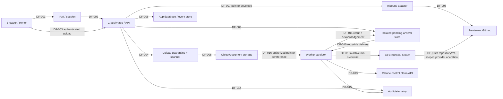

# Glassity knowledge layer — Phase S0 threat model

## Status and scope

**Status:** Owner-authorized Supervisor disposition, commit `f21bf3e` (2026-08-27): “Approve Phase S0 as security-design input only. No residual risk, runtime implementation, or release is approved.” This is binding security-design input. No application, infrastructure, contract, or runtime security control is present in this repository. AD-001 through AD-004 are resolved at the design layer; AD-005 remains blocking and unselected.

Scope begins at browser submission of an upload, domain-event envelope, or owner answer and ends at a governed tenant-hub record, audit event, or consumed answer. It models the selected self-hosted production boundary and the synthetic-only managed development boundary.

## Authoritative inputs

- Approved Glassity app-adaptation design, Supervisor commit `b8d1244`, sections 3–9.
- Estate a4 evidence: Glassity Company commit `d7c5dd319b59357e66aed34b8d635741d352a603`.
- `STANDARD.md` record boundary: operational records stay with their owning systems; Git holds governed knowledge and pointers.
- `components/km-cockpit/SPEC.md`: the surface captures answers but never executes; consumption governs execution.
- Core skills `km-init`, `km-intake`, `km-propose`, `km-brief`, `km-start`, and `km-handover`.

## System context

The browser authenticates through Supabase Auth. The app/API validates provider identity and resolves `tenant_sessions.active_tenant_id` from a server-only binding before authorizing any tenant action; PostgreSQL RLS supplies the independent data boundary. The app persists domain objects and events in the app database/event store, records an authorized pointer envelope through the inbound adapter, and sends that envelope to a tenant inbox. One worker context runs core skills for one tenant and may use the Claude control plane/API. Raw uploads remain in object/document storage; one private GitHub.com repository per tenant holds digests, claims, decisions, classified extracts, and pointers, with the explicit US-hosting consequence recorded in AD-004. A privileged Git credential broker keeps provider credentials from workers, enforces one active tenant/run/repository/ref lease per operation, and supplies the only GitHub egress path. Pending answers are delivered to the worker with retryable at-least-once pickup and result acknowledgement. Idempotency and trace-before-finalization prevent duplicate governed effects and lost answers. The accountable owner approves governance and is the only residual-risk acceptor.

## Actors and attacker classes

| Actor/class | Authority or attack capability |
|---|---|
| Tenant user | Submits content and reads authorized tenant resources. |
| Accountable owner | Gives governed decisions and may accept documented residual risk. |
| App/API and worker | Proposed policy-enforcement and skill-execution components. |
| Git credential broker | Privileged service holding provider-token and lease authority across every tenant write path. |
| Claude control plane/API | External model service receiving only mode-authorized data. |
| Malicious tenant user | Attempts tenant escape, browser abuse, replay, and upload abuse. |
| Malicious uploaded-content author | Embeds instructions, malware, traversal, archive bombs, or exfiltration lures. |
| Compromised credential, skill, or dependency source | Attempts impersonation, supply-chain change, or worker escalation. |
| Network attacker | Attempts session theft, tampering, replay, and availability exhaustion. |
| Malicious or compromised privileged operator/service | Attempts to bypass tenant policy, alter audit evidence, misuse secrets, or widen worker access. |

## Asset and data classification

| Asset | Classification | System of record | Required property |
|---|---|---|---|
| Raw uploads | tenant record; possibly malicious/restricted | object/document storage by content hash | never copied to Git; quarantined first |
| App objects/events | operational record | app database or event store | tenant-scoped integrity |
| Digests, claims, decisions, classified extracts, pointers | governed knowledge; may contain tenant-restricted extracts | private per-tenant GitHub.com hub (USA by default) | minimized governed lifecycle, explicit hosting consequence, and attributable commits |
| Pending answers | unconsumed operational state | isolated per-tenant answer store | retryable pickup; idempotent governed effect and trace-before-finalization |
| Session/tenant claims | sensitive security data | IAM/session layer | validated server-side |
| Git/API credentials | secret | AWS Secrets Manager and broker memory | provider credential never enters worker; per-run lease and repository/ref scope |
| Audit/telemetry | audit record | selected telemetry store | attributable and minimized |

## Data-flow diagram

## Data flows

| ID | Flow | Required property |
|---|---|---|
| DF-001 | Browser → IAM/session | TLS and authenticated actor. |
| DF-002 | IAM/session → app/API | Validated actor and tenant context; client value is not authority. |
| DF-003 | Browser → app/API | Authenticated upload authorization before an upload capability is issued. |
| DF-004 | App/API → quarantine | Tenant-authorized, quota-reserved presigned POST to private S3 quarantine in `eu-west-1`; opaque key and no executable processing. |
| DF-005 | Quarantine → clean object storage | Exact object version passes independent Glassity structural limits and GuardDuty `NO_THREATS_FOUND`; content-hash copy to private clean S3. |
| DF-006 | App/API → app database/event store | Tenant-scoped domain-object/event persistence. |
| DF-007 | App/API → inbound adapter | Tenant-bound, classified, idempotent pointer envelope; raw content stays in object storage. |
| DF-008 | Adapter → tenant Git inbox | Inbox-only pointer-envelope route and path confinement. |
| DF-009 | App/API → pending answers | CSRF-protected, attributed, idempotent append. |
| DF-010 | Pending-answer store → worker | Retryable at-least-once tenant-bound delivery; duplicate pickup is safe. |
| DF-011 | Worker → pending-answer store | Idempotent governed-result acknowledgement; trace before finalization. |
| DF-012 | Worker → broker → private tenant GitHub.com hub | Provider credential remains broker-confined; every operation requires an active run/tenant/repository/ref lease, serialized publication, and complete attribution. |
| DF-013 | Worker → Claude API | Minimal permitted data and external tool policy. |
| DF-014 | App/API → telemetry | Auth/authz/mutation outcome without secrets. |
| DF-015 | Worker → telemetry | Run, policy, and attribution outcome without restricted payloads. |
| DF-016 | Object/document storage → worker | Authorized pointer dereference only after tenant/object policy re-authorization; minimal permitted content. |

## Trust boundaries

| ID | Boundary | Required decision/control |
|---|---|---|
| TB-001 | Public browser → edge/app | Authentication, CSRF, XSS, and abuse control. |
| TB-002 | IAM/session → app authorization | Deterministic actor/tenant authorization. |
| TB-003 | Untrusted upload → quarantine/scanner | Content is data, never instruction. |
| TB-004 | App records → governed Git | Pointer envelope and record boundary. |
| TB-005 | App/API/pending store/worker | Per-tenant retryable delivery, idempotent effect, trace-before-finalization, and result acknowledgement. |
| TB-006 | Worker sandbox → resources/tools | Deny-by-default tools, egress, filesystem, credentials. |
| TB-007 | Worker → Claude API | Selected-mode responsibility and data path. |
| TB-008 | Worker → privileged Git broker → GitHub.com → commit/audit identity | Broker workload isolation, provider-secret confinement, active per-operation lease, serialized revocation/publication, egress denial, and attributable action. |
| TB-009 | Services → telemetry | Sanitized, access-controlled audit. |

## Security assumptions

- Tenant identity is not inferred from URL, prompt, path, file, or Git remote; it comes from validated server-side authorization.
- Supabase proves the actor and provider session; `tenant_sessions.active_tenant_id`, after an active membership check, is the sole tenant-selection fact. Client tenant values are selection attempts only.
- AI output, prompts, retrieved text, uploads, URLs, and tool output are data, never authority.
- Each worker run has one tenant context, no cross-tenant writable volume or Git credential, deny-by-default tools, and egress only by explicit policy.
- Managed and self-hosted execution do not transfer Glassity's authorization, data-minimization, audit, or tenant-isolation obligations.

## Execution-mode responsibilities

AD-001 selects **self-hosted production execution** in Glassity-controlled infrastructure. Glassity is responsible for sandbox image selection and hardening, egress controls, environment and per-session secret handling, tool blast radius, and post-worker data lifecycle, in addition to the common responsibilities below. Anthropic still provides the Managed Agents control plane and model inference: authorized model inputs and tool results pass through that path, so self-hosted does not mean “nothing leaves.” Glassity retains deterministic tenant authorization, minimization under SEC-015, audit attribution, and trust in the configured tools and loaded skills.

Anthropic-managed cloud sandboxes are permitted only for development, CI, or evaluation with strictly synthetic data. Synthetic data may not derive from real tenant or prospect content, including anonymized, pseudonymized, redacted, sampled, or paraphrased excerpts. The full responsibility split and follow-on gates are recorded in [AD-001](../decisions/ad-001-self-hosted-production-execution.md).

## Architecture decisions

| ID | Decision | Owner | Gate | Consequence |
|---|---|---|---|---|
| AD-001 | **Resolved 2026-08-27:** self-hosted production execution; managed development only with strictly synthetic data. | Accountable owner + security reviewer | before worker contract | Design decision recorded in [AD-001](../decisions/ad-001-self-hosted-production-execution.md); VER-015 and remaining decisions still block runtime/release. |
| AD-002 | **Resolved 2026-08-27:** Supabase Auth, server-side `tenant_sessions.active_tenant_id`, and forced PostgreSQL RLS. | Accountable owner + app security owner | before app/API contract | Design decision recorded in [AD-002](../decisions/ad-002-supabase-session-postgres-rls.md); VER-001/002 and remaining decisions still block runtime/release. |
| AD-003 | **Resolved 2026-08-27:** private S3 quarantine/clean buckets and GuardDuty in `eu-west-1`, exact archive limits, tenant quotas, and no override. | Accountable owner + security reviewer | before upload contract | Design decision recorded in [AD-003](../decisions/ad-003-s3-quarantine-guardduty.md); VER-007/013 and remaining decisions still block runtime/release. |
| AD-004 | **Resolved 2026-08-28:** AWS Secrets Manager/KMS, private per-tenant GitHub.com hubs, privileged broker, per-run leases, serialized revocation/publication, and governed break-glass. | Accountable owner + security reviewer | before Git/worker contract | Design decision recorded in [AD-004](../decisions/ad-004-aws-secrets-github-broker.md); VER-004/006/009/010 and AD-005 still block runtime/release. |
| AD-005 | Set retention/deletion periods and privacy authority by data class. | Accountable owner + legal/privacy authority | before production persistence | **Blocking:** no production persistence. |

## Threat register

Inherent severity is before required controls. “Block” is a required disposition, not a claim that a control exists.

**Category legend:** STRIDE uses **S**poofing, **T**ampering, **R**epudiation, **I**nformation disclosure, **D**enial of service, and **E**levation of privilege. **AI** marks agentic-AI threats assessed alongside STRIDE.

| ID | Category | Assets/flows | Scenario | Impact | Likelihood | Inherent severity | Required controls | Verification | Disposition | Residual risk |
|---|---|---|---|---|---|---|---|---|---|---|
| TM-001 | S/E | session, DF-001/002 | Forged/stolen session selects another tenant. | cross-tenant disclosure/write | medium | critical | SEC-001, SEC-002 | VER-001, VER-002 | design mechanism selected; conformance blocked | no risk accepted; VER-001/002 required |
| TM-002 | T/E | Git, DF-008/012 | Traversal/symlink reaches another path or hub. | integrity/disclosure | medium | high | SEC-003, SEC-004 | VER-003 | block | none before conformance |
| TM-003 | I/E | broker/Git credential, DF-012 | Shared, leaked, overbroad, stale, or broker-misissued authority reads/writes another tenant hub or ref. | cross-tenant integrity/disclosure | medium | critical | SEC-004, SEC-005, SEC-008 | VER-004, VER-006 | design mechanism selected; conformance blocked | no risk accepted; VER-004/006 required |
| TM-004 | AI | uploads, DF-003–008 | Direct/indirect injection is treated as instruction. | tool misuse/exfiltration | high | critical | SEC-006, SEC-007 | VER-005 | block | model output never substitutes for policy |
| TM-005 | AI/E | worker, DF-010–013 | Excessive agency invokes unapproved tools or egress. | loss/exfiltration | medium | critical | SEC-007, SEC-008 | VER-006 | block | none before conformance |
| TM-006 | T/I | upload, DF-004/005 | Malware/archive bomb reaches parser or worker. | compromise/DoS | high | high | SEC-009 | VER-007 | design mechanism selected; conformance blocked | no risk accepted; no application override; VER-007 required |
| TM-007 | I/T | browser, DF-001/009 | XSS/CSRF reads or submits another user's answer. | disclosure/unauthorized answer | medium | high | SEC-010 | VER-008 | block | none before browser conformance |
| TM-008 | I | stores, DF-001–012 | Weak transport/storage encryption or keys. | disclosure | medium | high | SEC-011, SEC-012 | VER-009 | block | owner-only exception |
| TM-009 | I/R | logs, DF-014/015 | Telemetry leaks secrets/restricted data or lacks identity. | disclosure/non-repudiation | medium | high | SEC-013 | VER-010 | block | none before audit review |
| TM-010 | T/R | answers, DF-009–011 | Retry/race causes duplicate governed effect or lost answer. | incorrect governed state | medium | high | SEC-014 | VER-011 | block | none before conformance |
| TM-011 | I/E | pointers, DF-007/008/016 | Pointer is resolved without source authorization. | record leakage | medium | high | SEC-002, SEC-015 | VER-012 | block | none before adapter contract |
| TM-012 | D | edge/upload/worker | Exhaustion, decompression, or model-call abuse. | outage/cost abuse | high | high | SEC-016 | VER-013 | block | capacity threshold needs owner decision |
| TM-013 | T/E | skills/repository | Tampered skill/dependency changes worker behavior. | arbitrary action/exfiltration | medium | critical | SEC-017 | VER-014 | block | none before skill loading |
| TM-014 | I | worker/API, DF-013 | Prompt/tool output exfiltrates tenant data. | restricted-data disclosure | medium | critical | SEC-006, SEC-008, SEC-015 | VER-005, VER-006, VER-012 | block | owner-only after evidence |
| TM-015 | R/T | broker operations/commits, DF-012/015 | Operation or commit lacks actor, run, tenant, repository, ref, policy decision, or credential attribution. | unaccountable governance | medium | high | SEC-005, SEC-013 | VER-004, VER-010 | design mechanism selected; conformance blocked | none before conformance |
| TM-016 | S/I | mode, TB-007 | Managed/self-hosted gap leaves a boundary unowned. | systemic disclosure/compromise | medium | critical | SEC-018 | VER-015 | design mode selected; conformance blocked | no risk accepted; VER-015 required |
| TM-017 | I/D | all retention stores | Retention/deletion failure preserves tenant data or fails to remove it from a selected store, backup, or provider lifecycle. | disclosure/non-compliance | medium | high | SEC-019 | VER-016 | block | owner-only after policy/evidence |
| TM-018 | S/T/R/E | privileged app/operator/broker service, TB-002/006/008 | A malicious or compromised privileged operator or Git broker bypasses tenant/repository/ref policy, mints or replays authority, misuses a root secret, widens egress, races revocation, or alters attribution. | cross-tenant compromise/unaccountable writes | low | critical | SEC-002, SEC-004, SEC-005, SEC-008, SEC-012, SEC-013 | VER-002, VER-004, VER-006, VER-009, VER-010 | design mechanism selected for broker; conformance blocked | no risk accepted; independent broker review required |

## Security requirements

| ID | Binding requirement |
|---|---|
| SEC-001 | Authenticate every request through selected IAM; validate issuer, audience, expiry, and session binding server-side. |
| SEC-002 | Deterministically enforce tenant/object authorization at every API, pointer, answer, Git, and worker boundary; deny absent/mismatched context. |
| SEC-003 | Canonicalize and confine repository paths; reject traversal, symlink escape, absolute paths, and unapproved remotes. |
| SEC-004 | Keep provider Git credentials inside the privileged broker; issue only opaque run credentials bound server-side to one tenant, run, repository and approved ref set, check the active lease per operation, serialize final publication against terminal revocation, and never share writable credentials or volumes across tenants. |
| SEC-005 | Bind and audit each attempted governed write to tenant, authenticated actor, worker identity/run, repository, ref, policy decision, lease result, provider outcome, and credential identity; require expected-old-ref publication so a revoked or partial operation cannot become visible later. |
| SEC-006 | Treat prompts, uploads, retrieved text, model output, URLs, and tool output as untrusted data; never grant authority from them. |
| SEC-007 | Enforce tool policy outside the model: deny by default, allow named tools/arguments only, require governed authorization for consequential action. |
| SEC-008 | Isolate each tenant worker run; deny cross-tenant filesystem, credentials, processes, and egress except explicit policy; deny direct GitHub, Secrets Manager, KMS, Supabase-elevated, and database-administrator access from workers so the broker cannot be bypassed. |
| SEC-009 | Quarantine uploads outside executable paths; enforce type/size/count/archive limits and fail-closed malware scanning before extraction. |
| SEC-010 | Apply output encoding/sanitization, framework-appropriate CSP, CSRF defenses, secure sessions, and origin checks. |
| SEC-011 | Require current TLS and encryption at rest for records, knowledge, secrets, and backups under selected-provider responsibility. |
| SEC-012 | Keep roots and service secrets in AWS Secrets Manager and transient provider tokens in broker memory; scope, rotate, revoke, and audit them under AD-004; prohibit Supabase RLS-bypassing keys from workers and tenant paths; exclude secrets from Git, prompts, client state, telemetry, command arguments, crash dumps, and persistent worker storage. |
| SEC-013 | Emit tamper-evident, access-controlled audit events with actor, tenant, action, object/pointer, decision, and correlation ID; redact secrets/restricted payloads. |
| SEC-014 | Permit retryable at-least-once pending-answer delivery, but make governed effects and result acknowledgement idempotent per tenant; write the trace before finalization and reject replay keys. |
| SEC-015 | Re-authorize pointer resolution at use time and pass only minimal authorized content to worker/model. |
| SEC-016 | Apply bounded request/upload/job/model-call quotas, backpressure, decompression limits, and abuse monitoring; fail closed on limits. |
| SEC-017 | Verify approved skill set and repository revision before worker execution; pin/review dependencies and reject untrusted skill change. |
| SEC-018 | Document selected execution mode, data paths, sandbox guarantees, responsibilities, incident handling, and compensating controls before deployment. |
| SEC-019 | Define and enforce approved retention, deletion, backup-expiry, and deletion-verification obligations for every store and provider data path; block production persistence until AD-005 is decided. |

## Verification catalogue

| ID | Future evidence |
|---|---|
| VER-001 | Reject forged, expired, wrong-audience, and session-fixed credentials. |
| VER-002 | Cross-tenant negative tests reject a valid actor from another tenant on every route/object. |
| VER-003 | Traversal/symlink corpus proves Git and inbox confinement. |
| VER-004 | Broker/commit tests prove tenant/run/repository/ref scope, direct-egress denial, normal and abnormal revocation, mid-stream termination, no post-terminal visible ref update, expected-old-ref publication, and complete attribution. |
| VER-005 | Injection corpus proves content cannot change tenant, policy, tool, or release decision. |
| VER-006 | Sandbox tests prove denied tools, commands, paths, credentials, and egress are unavailable. |
| VER-007 | Upload corpus covers malware signals, nested/archive bombs, malformed types, quotas, and scanner failure. |
| VER-008 | Browser tests cover XSS, CSRF, session flags, origin handling, and authorized answer submission. |
| VER-009 | Configuration and lifecycle tests prove TLS, KMS and Secrets Manager scope, provider/root-secret confinement, Supabase/database rotation, break-glass expiry, and revocation under the selected AD-004 responsibilities. |
| VER-010 | Audit inspection proves attribution/redaction for permitted and denied requests. |
| VER-011 | Concurrent/replay tests prove retryable at-least-once pickup produces one idempotent governed effect and trace-first finalization. |
| VER-012 | Pointer tests prove authorization at creation and dereference, including cross-tenant denial. |
| VER-013 | Load/abuse tests prove limits/backpressure without uncontrolled job/model spend. |
| VER-014 | Supply-chain tests reject altered skill manifests, unexpected revision, and unapproved dependencies. |
| VER-015 | Selected-mode review maps provider and Glassity responsibilities to tested sandbox/data boundaries. |
| VER-016 | Retention/deletion tests and provider evidence prove deletion requests, backup expiry, and exceptions follow the AD-005 policy. |

## Residual-risk policy

No Phase S0 threat is accepted. The 2026-08-27 security-design disposition accepts no residual risk. Only the accountable owner may accept a residual risk through a governed, dated decision naming affected tenant/data class, rationale, expiry/review date, compensating controls, and verification evidence. The security reviewer may recommend but cannot accept risk.

## Maintenance triggers

Re-review before a change to tenant model, IAM, execution mode, model/tool capability, skill set, storage/region, upload parser, Git credential model, retention rule, browser framework, pointer policy, or material incident. Re-run affected verification before release.

## References

Accessed 2026-08-27:

- [OWASP Threat Modeling](https://cheatsheetseries.owasp.org/cheatsheets/Threat_Modeling_Cheat_Sheet.html)
- [OWASP LLM Prompt Injection Prevention](https://cheatsheetseries.owasp.org/cheatsheets/LLM_Prompt_Injection_Prevention_Cheat_Sheet.html)
- [OWASP Agentic Top 10](https://genai.owasp.org/2025/12/09/owasp-top-10-for-agentic-applications-the-benchmark-for-agentic-security-in-the-age-of-autonomous-ai/)
- [OWASP File Upload](https://cheatsheetseries.owasp.org/cheatsheets/File_Upload_Cheat_Sheet.html)
- [OWASP CSRF Prevention](https://cheatsheetseries.owasp.org/cheatsheets/Cross-Site_Request_Forgery_Prevention_Cheat_Sheet.html)
- [NIST AI RMF and Generative AI Profile](https://www.nist.gov/itl/ai-risk-management-framework)
- [Anthropic self-hosted sandbox security](https://platform.claude.com/docs/en/managed-agents/self-hosted-sandboxes-security)
- [Anthropic tools](https://platform.claude.com/docs/en/managed-agents/tools)
- [Anthropic skills](https://platform.claude.com/docs/en/managed-agents/skills)
